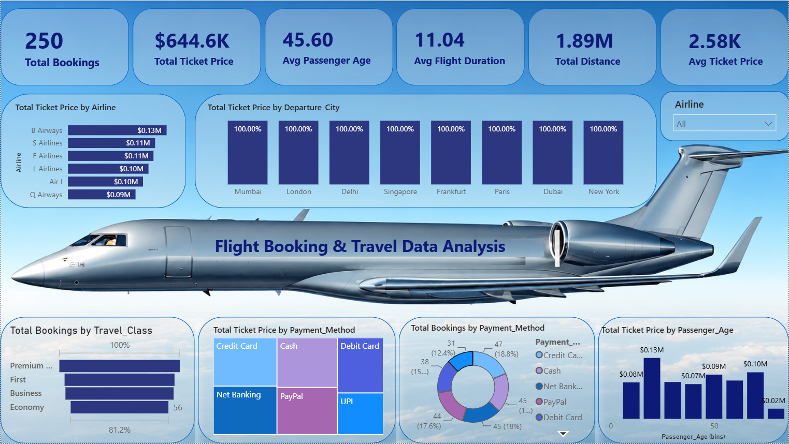

# ✈️ Flight Booking & Travel Data Analysis Dashboard

## 📌 Project Overview

This project is an interactive **Power BI Dashboard** built to analyze flight booking and travel data. The dashboard provides valuable insights into booking trends, ticket prices, passenger demographics, travel classes, payment methods, and airline performance through dynamic visualizations.

The objective of this project is to transform raw flight booking data into meaningful business insights that can support better decision-making.

---

## 📊 Dashboard Preview

> *(Add your dashboard screenshot here)*

---

## 🎯 Key Performance Indicators (KPIs)

- Total Bookings
- Total Ticket Price
- Average Passenger Age
- Average Flight Duration
- Total Distance
- Average Ticket Price

---

## 📈 Dashboard Features

### Airline Analysis
- Total Ticket Price by Airline

### City Analysis
- Total Ticket Price by Departure City

### Travel Class Analysis
- Total Bookings by Travel Class

### Payment Analysis
- Total Ticket Price by Payment Method
- Total Bookings by Payment Method

### Passenger Analysis
- Total Ticket Price by Passenger Age

### Interactive Filter
- Airline Slicer

---

## 🛠️ Tools & Technologies

- Microsoft Power BI
- Power Query
- DAX
- Data Modeling
- Data Visualization

---

## 📂 Dataset

The dataset contains information related to flight bookings, including:

- Booking ID
- Passenger Name
- Passenger Age
- Airline
- Departure City
- Destination
- Travel Class
- Ticket Price
- Flight Duration
- Distance
- Payment Method

---

## 📌 DAX Measures Used

- Total Bookings
- Total Ticket Price
- Average Passenger Age
- Average Flight Duration
- Total Distance
- Average Ticket Price

---

## 📊 Business Insights

- Identified airlines generating the highest ticket revenue.
- Compared ticket prices across different departure cities.
- Analyzed booking distribution by travel class.
- Evaluated customer payment preferences.
- Studied ticket pricing across passenger age groups.
- Created interactive filters for dynamic analysis.

---

## 📚 Skills Demonstrated

- Data Cleaning
- Data Transformation
- Data Modeling
- DAX Calculations
- KPI Design
- Interactive Dashboard Development
- Business Intelligence
- Data Storytelling

---

## 🚀 How to Use

1. Download the `.pbix` file.
2. Open it using Microsoft Power BI Desktop.
3. Refresh the data if required.
4. Use the Airline slicer to interact with the dashboard.

---

## 👩‍💻 Author

**Himani Kotnala**

- LinkedIn: https://www.linkedin.com/in/himani-kotnala-30a532311/
- GitHub: https://github.com/himanikotnala

---

## ⭐ If you found this project useful, don't forget to Star the repository!
